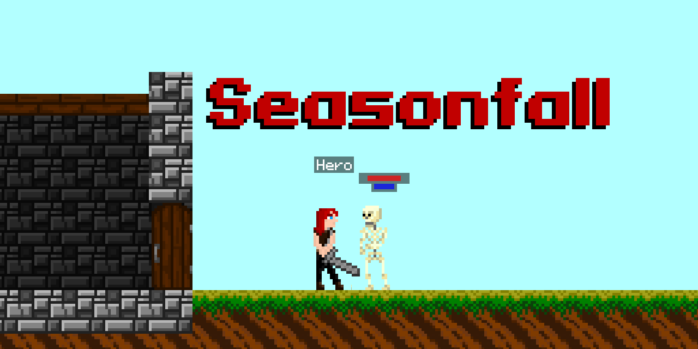

# Seasonfall

[](https://github.com/Starlight-Skull/seasonfall/actions/workflows/webpack.yml)
[](https://github.com/Starlight-Skull/seasonfall/actions/workflows/codeql-analysis.yml)

[](https://github.com/Starlight-Skull/seasonfall#readme)

> [Play current stable version: v1.2.0](https://starlight-skull.github.io/seasonfall/)
> Development for native releases is on hold for the time being.

## Project Status

Major rewrites to make code more accessible, reusable and efficient.

v2.0.0 changes:

- [x] define world as a 2d grid
- [x] rebuild ui using React
- [x] implement world editor
- [ ] controller support
- [ ] mobile support
- [ ] improved collision system
- [ ] improved weather system
- [x] improved render system

## Local development

### Install

_Requirements: [git](https://git-scm.com/downloads), [npm](https://nodejs.org/en/download/)_

```sh
git clone https://github.com/starlight-skull/seasonfall.git
cd seasonfall
npm ci
```

### Dev server

```sh
npm run start
```

### Build

```sh
npm run build:dev
npm run build:prod
```
